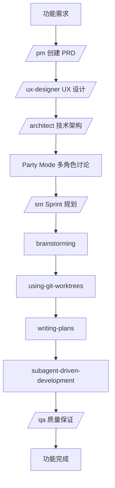

# BMAD + Superpowers 组合实战示例

**功能**: 教师智能任务批改工作台
**项目**: Composition Evaluator
**日期**: 2026-02-23

---

## 📋 功能需求概述

**背景**:
教师需要批改学生提交的作文。当前系统只有基础的学生提交功能,缺少教师的批改界面。

**目标**:
构建一个智能批改工作台,支持:
- 批量查看学生提交
- AI 辅助批改(多模型协作)
- 手动批改和评语
- 批改历史记录
- 实时保存和恢复
- 批改进度跟踪

---

## 🎯 完整工作流程



---

## 🎬 阶段 1: BMAD - 产品发现与设计 (2-3天)

### Step 1: 产品需求文档 (PM)

```bash
# 激活 PM 代理
/pm
```

**PM 代理引导对话**:

```
🤖 PM: 我是产品经理。让我们先理解这个批改工作台的需求。

**问题 1**: 目标用户是谁?
A. 只有教师
B. 教师和助教
C. 教师、助教和教研组长

你: 选择 B

**问题 2**: 核心使用场景是什么?
A. 批改单个班级的作文
B. 批改多个班级的作文
C. 批改全校的作文

你: 选择 B

**问题 3**: AI 辅助的期望是什么?
A. 完全自动批改,教师只审核
B. AI 给出建议,教师决定是否采纳
C. AI 仅评分,评语由教师写

你: 选择 B
```

**输出文档**: `_bmad-output/planning-artifacts/prd.md`

```markdown
# 教师智能任务批改工作台 PRD

## 产品愿景
让教师高效、智能地批改学生作文,减轻批改负担,提高批改质量。

## 目标用户
- 主要: 教师
- 次要: 助教

## 核心功能
1. **批量查看**: 一屏展示多个学生提交
2. **AI 辅助**: 多 AI 模型协作给出批改建议
3. **手动批改**: 教师可修改 AI 建议,添加个性化评语
4. **实时保存**: 防止数据丢失
5. **进度跟踪**: 显示已批改/未批改数量

## 用户故事
```
作为教师,
我想要在一个页面看到所有学生提交,
这样我可以快速了解整体情况,
并选择优先批改的作文。

作为教师,
我想要 AI 给出批改建议,
这样我可以参考专业意见,
并根据自己的判断调整。
```

## 验收标准
- [ ] 教师可在 30 秒内开始批改第一篇作文
- [ ] AI 建议在 10 秒内返回
- [ ] 批改过程中每 30 秒自动保存
- [ ] 教师可在 3 分钟内完成一篇作文的批改
```

---

### Step 2: UX 设计规范 (UX Designer)

```bash
# 激活 UX 设计师代理
/ux-designer
```

**UX Designer 代理引导 14 步工作流**:

#### Step 1-2: 项目理解

```
🎨 UX Designer: 让我理解这个批改工作台的 UX 挑战。

**核心体验原则**:
1. **流畅性**: 教师应该进入"心流状态",不被界面打断
2. **专业性**: 传达教育专业性,赢得教师信任
3. **效率性**: 减少点击和滚动,最大化信息密度

**关键 UX 挑战**:
1. 如何在一个屏幕展示多个学生提交而不拥挤?
2. 如何平衡 AI 建议和教师自主权?
3. 如何支持教师快速跳转和对比?
```

#### Step 3-4: 核心体验定义

```
**核心用户操作**: 批改作文(选择 → 阅读 → 评阅 → 提交)

**平台策略**:
- 桌面优先(教师主要用电脑批改)
- 支持键盘快捷键
- 支持多标签页(同时打开多篇作文)

**无缝交互**:
- 自动保存,无需手动点击
- 键盘导航,无需鼠标
- AI 建议后台加载,不阻塞操作

**关键成功时刻**:
- 教师第一次看到 AI 建议时,"哇,这很有用"
- 教师快速批改完 10 篇作文时,"效率提升明显"
```

#### Step 5-8: 设计系统与视觉基础

```
**设计系统选择**: Ant Design

**理由**:
- 中文 UI,教师熟悉
- Table 组件强大,适合批量展示
- Form 组件完善,适合批改表单
- 中文文档,易于维护

**品牌对齐**:
- 主色调: 保持现有的教育蓝色 (#1890ff)
- 辅助色: 绿色(通过)、橙色(待批改)、红色(退回)
- 字体: 中文使用苹方,英文使用 Inter

**视觉层次**:
- 最重要的: 学生作文内容(最大字号,居中)
- 次重要的: AI 批改建议(卡片形式,侧边)
- 辅助信息: 学生信息、提交时间(顶部小字)
```

#### Step 9-11: 设计方向与组件策略

```
**设计方向**: 三栏布局

┌─────────────────────────────────────────────────────────┐
│  🔍 搜索  │  筛选  │  批改进度: 8/10  │         保存    │
├──────────┬────────────────────────┬─────────────────────┤
│          │                        │   AI 批改建议        │
│  学生    │    作文内容            │   ┌─────────────┐   │
│  列表    │    (主要区域)          │   │ 总分: 85/100 │   │
│          │                        │   │             │   │
│ ┌────┐   │  ┌──────────────────┐  │   │ 优点:       │   │
│ │张三│   │  │  春天的景色      │  │   │ - 描写生动  │   │
│ ├────┤   │  │                  │  │   │             │   │
│ │李四│ ★ │  │  春天来了...     │  │   │ 建议:       │   │
│ ├────┤   │  │                  │  │   │ - 补充细节  │   │
│ │王五│ ✓ │  │  [全文]          │  │   │             │   │
│ └────┘   │  └──────────────────┘  │   └─────────────┘   │
│          │                        │                     │
│          │  [教师批改区域]        │   [采纳建议] [修改] │
│          │  ┌──────────────────┐  │                     │
│          │  │ 总分: [90]       │  │   批改历史          │
│          │  │ 评语: [____]     │  │   - 2024-01-01     │
│          │  │ [提交] [保存]    │  │   - 2024-01-02     │
│          │  └──────────────────┘  │                     │
└──────────┴────────────────────────┴─────────────────────┘

**组件策略**:

**基础组件** (来自 Ant Design):
- Table - 学生列表
- Card - AI 建议卡片
- Form - 批改表单
- Input.TextArea - 评语输入
- Button - 提交/保存按钮
- Badge - 进度标记
- Spin - 加载状态

**自定义组件**:
1. `SubmissionViewer` - 作文查看器
   - 支持全文/摘要切换
   - 高亮关键词
   - 显示字数统计

2. `AISuggestionPanel` - AI 建议面板
   - 折叠/展开
   - 采纳/修改建议
   - 显示 AI 置信度

3. `GradingForm` - 批改表单
   - 实时保存
   - 快捷评语
   - 历史评语搜索

4. `StudentList` - 学生列表
   - 批改状态标记
   - 快速跳转
   - 批量操作

5. `GradingProgress` - 进度跟踪
   - 已批改/未批改
   - 预计剩余时间
   - 保存提示
```

#### Step 12-14: UX 模式与可访问性

```
**导航模式**:
- 键盘快捷键:
  - `J`: 下一个学生
  - `K`: 上一个学生
  - `S`: 保存
  - `Cmd+Enter`: 提交

**表单模式**:
- 实时验证(分数范围)
- 自动保存(30秒)
- 离开提示(未保存警告)

**反馈模式**:
- 保存成功: Toast 提示
- AI 加载: Skeleton
- 提交成功: 庆祝动画

**可访问性**:
- WCAG AA 合规
- 键盘完全可操作
- ARIA 标签完整
- 色彩对比度 ≥ 4.5:1
```

**输出文档**: `_bmad-output/planning-artifacts/ux-design-specification.md`

---

### Step 3: 技术架构设计 (Architect)

```bash
# 激活架构师代理
/architect
```

**Architect 代理引导对话**:

```
🏗️ Architect: 让我设计批改工作台的技术架构。

**架构选择**:

前端:
- 框架: Next.js 15 (已有)
- 状态管理: Zustand (轻量级)
- 数据获取: React Query (缓存、实时更新)
- UI 组件: Ant Design
- 实时保存: 自定义 hooks + localStorage

后端:
- 框架: FastAPI (已有)
- 数据库: PostgreSQL (已有)
- AI 服务: 多模型协作 (Claude + GPT-4 + Gemini)
- 缓存: Redis (AI 结果缓存)
- 实时通信: WebSocket (可选,未来支持)

**数据模型**:

```sql
-- 批改记录表
CREATE TABLE grading_records (
    id UUID PRIMARY KEY,
    submission_id UUID REFERENCES submissions(id),
    teacher_id UUID REFERENCES auth_accounts(id),

    -- AI 批改结果(JSON)
    ai_suggestions JSONB,

    -- 教师批改
    score INTEGER,
    feedback TEXT,
    adopted_suggestions TEXT[],

    -- 状态
    status VARCHAR(20), -- draft, submitted, returned

    -- 时间戳
    created_at TIMESTAMPTZ,
    updated_at TIMESTAMPTZ,
    submitted_at TIMESTAMPTZ,

    -- 版本
    version INTEGER DEFAULT 1
);

-- 批改历史表
CREATE TABLE grading_history (
    id UUID PRIMARY KEY,
    grading_record_id UUID REFERENCES grading_records(id),
    changes JSONB,
    created_at TIMESTAMPTZ
);
```

**API 设计**:

```
GET  /api/v1/grading/submissions?task_id={task_id}
  - 获取待批改的学生提交列表

GET  /api/v1/grading/submissions/{submission_id}
  - 获取单个提交详情

POST /api/v1/grading/ai-suggest
  - 请求 AI 批改建议
  - Body: { submission_id, model_type }
  - Response: { suggestions, confidence, cached }

PUT  /api/v1/grading/records/{record_id}
  - 保存批改记录(自动保存)

POST /api/v1/grading/records/{record_id}/submit
  - 提交批改结果

GET  /api/v1/grading/records/{record_id}/history
  - 获取批改历史
```

**AI 服务架构**:

```
┌─────────────┐
│   前端      │
└──────┬──────┘
       │ HTTP
┌──────▼──────┐
│ FastAPI     │
└──────┬──────┘
       │
       ├─────────────┬──────────────┬──────────────┐
       │             │              │              │
┌──────▼──────┐ ┌───▼────┐ ┌──────▼──────┐ ┌─────▼─────┐
│   Claude    │ │ GPT-4  │ │   Gemini    │ │  Redis    │
│  (内容分析) │ │(评分)  │ │(评语生成)   │ │  (缓存)   │
└─────────────┘ └────────┘ └─────────────┘ └───────────┘
```

**安全性**:
- 教师只能批改自己班级的提交
- AI 建议缓存 24 小时
- 自动保存使用 debounce(防抖)

**输出文档**: `_bmad-output/planning-artifacts/architecture.md`
```

---

### Step 4: Party Mode - 多角色讨论

```bash
# 启动 Party Mode
/party-mode
```

**对话场景**:

```
你: Bring in the PM, UX Designer, and Architect to discuss the AI suggestion feature.

🤝 Party Mode: 已邀请 PM、UX Designer、Architect 加入讨论。

---

👤 PM: 从产品角度,AI 建议功能很关键。但要确保教师感觉"被赋能"而不是"被替代"。

🎨 UX Designer: 同意。我的建议是:
1. AI 建议默认折叠,让教师主动查看
2. 显示"建议置信度",让教师判断
3. 提供"完全采纳"、"部分采纳"、"不采纳"三个选项

🏗️ Architect: 技术上可行。我补充:
1. 使用多个 AI 模型,给出综合建议
2. 缓存 AI 结果,避免重复计算
3. 异步加载,不阻塞页面

👤 PM: 赞成!但"置信度"怎么计算?

🏗️ Architect: 可以用多个模型的一致性。如果 3 个模型都给 85 分,置信度就高。

🎨 UX Designer: 那怎么展示置信度?

👤 PM: 我建议用颜色:
- 高置信度(≥80%): 绿色,显示"AI 高度推荐"
- 中置信度(50-79%): 黄色,显示"AI 建议"
- 低置信度(<50%): 灰色,显示"AI 仅供参考"

🎨 UX Designer: 完美!这既传达了专业性,又保留了教师的自主权。

🏗️ Architect: 技术实现上,我还需要考虑成本。每次批改都调用 3 个模型,费用可能很高。

👤 PM: 那可以加个设置,让教师选择是否启用 AI,以及使用几个模型。

🎨 UX Designer: 同意!默认用 1 个模型(GPT-4),教师可以升级到 3 模型。

---

✅ Party Mode 总结: 达成一致
1. AI 建议默认折叠
2. 三档置信度(高/中/低)用颜色区分
3. 默认 1 模型,可升级到 3 模型
4. 缓存 24 小时,降低成本
```

---

### Step 5: Sprint 规划 (Scrum Master)

```bash
# 激活 Scrum Master
/sm
```

**Scrum Master 引导**:

```
📊 Scrum Master: 让我们将这个功能分解为可执行的任务。

**Sprint 1: 核心批改流程** (3-5天)

Story 1: 学生列表展示
- [ ] API: GET /grading/submissions
- [ ] 组件: StudentList
- [ ] 状态标记(未批改/草稿/已完成)

Story 2: 作文内容展示
- [ ] API: GET /grading/submissions/{id}
- [ ] 组件: SubmissionViewer
- [ ] 全文/摘要切换

Story 3: 批改表单
- [ ] API: PUT /grading/records/{id}
- [ ] 组件: GradingForm
- [ ] 实时保存

**Sprint 2: AI 辅助功能** (2-3天)

Story 4: AI 建议请求
- [ ] API: POST /grading/ai-suggest
- [ ] 组件: AISuggestionPanel
- [ ] 折叠/展开

Story 5: 多模型协作
- [ ] Claude: 内容分析
- [ ] GPT-4: 评分
- [ ] Gemini: 评语生成
- [ ] 结果聚合

**Sprint 3: 优化与测试** (2-3天)

Story 6: 进度跟踪
- [ ] 组件: GradingProgress
- [ ] 键盘快捷键

Story 7: 批改历史
- [ ] API: GET /grading/records/{id}/history
- [ ] 历史记录展示

Story 8: 测试与 QA
- [ ] 单元测试
- [ ] E2E 测试
- [ ] 性能测试

**输出文档**: `_bmad-output/implementation-artifacts/sprint-plans/grading-workshop-sprint-1.md`
```

---

## 🚀 阶段 2: Superpowers - 技术实施 (5-7天)

### Step 6: Brainstorming - 技术方案讨论

```bash
# Superpowers brainstorming 自动触发
# 或手动触发
brainstorming
```

**Brainstorming Skill 引导对话**:

```
🧠 Brainstorming: 让我理解我们要实现的技术方案。

**问题 1**: 当前项目状态是什么?
你:
- 前端: Next.js 15, TypeScript, Tailwind CSS
- 后端: FastAPI, PostgreSQL, SQLAlchemy
- 已有: 学生提交 API, 教师认证
- 缺少: 批改相关的 API 和前端组件

**问题 2**: 技术栈选择?

**选项 A**: 使用 shadcn/ui + Tailwind
- 优点: 轻量级,完全可定制
- 缺点: 需要自己实现 Table、Form 等组件

**选项 B**: 使用 Ant Design (推荐)
- 优点: Table、Form 组件完善,中文友好
- 缺点: 较重,需要定制主题

**选项 C**: 使用 Chakra UI
- 优点: 组件丰富,可访问性好
- 缺点: 中文支持不如 Ant Design

你: 选择 B (Ant Design)

**问题 3**: 实施顺序?

**选项 A**: 从后端 API 开始,再做前端
- 优点: API 先稳定,前端对接简单
- 缺点: 前端需要等待

**选项 B**: 前后端并行 (推荐)
- 优点: 速度快,可独立测试
- 缺点: 需要先定义 API contract

**选项 C**: 从前端 mock 开始,再做后端
- 优点: 前端可快速迭代
- 缺点: 后期对接可能需要调整

你: 选择 B (前后端并行)

**问题 4**: AI 服务集成?

**选项 A**: 同步调用
- 优点: 简单
- 缺点: 阻塞用户操作

**选项 B**: 异步调用 + 轮询 (推荐)
- 优点: 不阻塞,用户体验好
- 缺点: 需要额外的任务队列

**选项 C**: WebSocket 推送最复杂
- 优点: 实时性最好
- 缺点: 实现复杂

你: 选择 B (异步调用 + 轮询)

✅ **设计总结**:

1. **技术栈**: Next.js 15 + Ant Design + FastAPI
2. **实施顺序**: 前后端并行,先定义 API contract
3. **AI 服务**: 异步调用 + Redis 缓存
4. **状态管理**: Zustand (轻量级) + React Query (服务端状态)

**输出文档**: `docs/plans/2026-02-23-grading-workshop-design.md`
```

---

### Step 7: Writing Plans - 详细实施计划

```bash
# Superpowers writing-plans 自动触发
writing-plans
```

**Writing Plans Skill 创建计划**:

```
📝 Writing Plans: 让我创建详细的实施计划。

**计划保存到**: `docs/plans/2026-02-23-grading-workshop-implementation.md`

---

# 教师批改工作台实施计划

> **For Claude:** REQUIRED SUB-SKILL: Use superpowers:subagent-driven-development to implement this plan task-by-task.

**目标**: 构建教师智能批改工作台,支持批量查看、AI 辅助、实时保存

**架构**: 前后端分离,并行开发,异步 AI 服务

**Tech Stack**: Next.js 15, Ant Design, FastAPI, PostgreSQL, Redis, Celery

---

## Task 1: 后端 - 数据模型与迁移

**Files**:
- Create: `backend/app/models/grading_record.py`
- Modify: `backend/app/models/__init__.py`
- Create: `alembic/versions/2026_02_23_add_grading_records.py`

**Step 1: Write the failing test**

```python
# tests/models/test_grading_record.py
def test_grading_record_creation(db_session):
    from app.models.grading_record import GradingRecord

    record = GradingRecord(
        submission_id="test-submission-id",
        teacher_id="test-teacher-id",
        score=85,
        feedback="Good work!",
        status="draft"
    )

    db_session.add(record)
    db_session.commit()

    assert record.id is not None
    assert record.score == 85
    assert record.status == "draft"
    assert record.created_at is not None
```

**Step 2: Run test to verify it fails**

```bash
cd backend
pytest tests/models/test_grading_record.py -v
# Expected: FAIL - "module 'app.models.grading_record' not found"
```

**Step 3: Write minimal implementation**

```python
# backend/app/models/grading_record.py
from datetime import datetime, timezone
from uuid import UUID, uuid4

from sqlalchemy import JSON, DateTime, Integer, String, Text
from sqlalchemy.orm import Mapped, mapped_column

from app.db.base import Base


def utcnow() -> datetime:
    return datetime.now(timezone.utc)


class GradingRecord(Base):
    __tablename__ = "grading_records"

    id: Mapped[UUID] = mapped_column(primary_key=True, default=uuid4)
    submission_id: Mapped[UUID] = mapped_column(index=True, nullable=False)
    teacher_id: Mapped[UUID] = mapped_column(index=True, nullable=False)

    ai_suggestions: Mapped[dict | None] = mapped_column(JSON, nullable=True)
    score: Mapped[int | None] = mapped_column(Integer, nullable=True)
    feedback: Mapped[str | None] = mapped_column(Text, nullable=True)
    adopted_suggestions: Mapped[list[str] | None] = mapped_column(JSON, nullable=True)

    status: Mapped[str] = mapped_column(String(20), default="draft", nullable=False)

    created_at: Mapped[datetime] = mapped_column(DateTime(timezone=True), default=utcnow, nullable=False)
    updated_at: Mapped[datetime] = mapped_column(DateTime(timezone=True), default=utcnow, onupdate=utcnow, nullable=False)
    submitted_at: Mapped[datetime | None] = mapped_column(DateTime(timezone=True), nullable=True)
```

**Step 4: Run test to verify it passes**

```bash
cd backend
pytest tests/models/test_grading_record.py -v
# Expected: PASS
```

**Step 5: Commit**

```bash
git add backend/app/models/grading_record.py tests/models/test_grading_record.py
git commit -m "feat(backend): add GradingRecord model with tests"
```

---

## Task 2: 后端 - API 端点实现

**Files**:
- Create: `backend/app/api/v1/endpoints/grading.py`
- Create: `backend/app/schemas/grading.py`
- Modify: `backend/app/api/v1/api.py`

**Step 1: Write the failing test**

```python
# tests/api/test_grading.py
from fastapi.testclient import TestClient

def test_get_submissions_for_grading(client: TestClient, teacher_token):
    response = client.get(
        "/api/v1/grading/submissions?task_id=test-task-id",
        headers={"Authorization": f"Bearer {teacher_token}"}
    )

    assert response.status_code == 200
    data = response.json()
    assert "items" in data
    assert isinstance(data["items"], list)
```

**Step 2-5**: (完整 TDD 循环)...

**Estimated**: 2-3 hours

---

## Task 3: 后端 - AI 服务集成

**Files**:
- Create: `backend/app/services/ai_grading.py`
- Create: `backend/app/workers/ai_tasks.py`
- Modify: `backend/app/core/config.py`

**Step 1: Write the failing test**

```python
# tests/services/test_ai_grading.py
import pytest
from app.services.ai_grading import AIServiceManager

@pytest.mark.asyncio
async def test_ai_service_manager_get_suggestions():
    manager = AIServiceManager()

    result = await manager.get_suggestions(
        content="春天来了,花儿开了。",
        title="春天的景色",
        student_age=10
    )

    assert result is not None
    assert "score" in result
    assert "feedback" in result
    assert 0 <= result["score"] <= 100
```

**Step 2-5**: (完整 TDD 循环,实现多模型协作)...

**Estimated**: 3-4 hours

---

## Task 4: 前端 - API Client 设置

**Files**:
- Create: `frontend/lib/api/grading.ts`
- Modify: `frontend/lib/api/client.ts`

**Step 1: Write the failing test**

```typescript
// frontend/lib/api/__tests__/grading.test.ts
import { getSubmissionsForGrading } from '../grading';

describe('Grading API', () => {
  it('should fetch submissions for grading', async () => {
    const submissions = await getSubmissionsForGrading({
      taskId: 'test-task-id'
    });

    expect(submissions).toBeDefined();
    expect(submissions.items).toBeInstanceOf(Array);
  });
});
```

**Step 2-5**: (完整 TDD 循环)...

**Estimated**: 1-2 hours

---

## Task 5: 前端 - StudentList 组件

**Files**:
- Create: `frontend/app/grading/_components/StudentList.tsx`
- Create: `frontend/app/grading/_components/StudentList.test.tsx`

**Step 1: Write the failing test**

```typescript
// StudentList.test.tsx
import { render, screen } from '@testing-library/react';
import { StudentList } from './StudentList';

describe('StudentList', () => {
  it('should render student list', () => {
    const mockSubmissions = [
      { id: '1', student_name: '张三', status: 'pending' },
      { id: '2', student_name: '李四', status: 'graded' }
    ];

    render(<StudentList submissions={mockSubmissions} />);

    expect(screen.getByText('张三')).toBeInTheDocument();
    expect(screen.getByText('李四')).toBeInTheDocument();
  });
});
```

**Step 2-5**: (完整 TDD 循环)...

**Estimated**: 2-3 hours

---

## Task 6: 前端 - GradingForm 组件 (核心)

**Files**:
- Create: `frontend/app/grading/_components/GradingForm.tsx`
- Create: `frontend/app/grading/_components/GradingForm.test.tsx`
- Create: `frontend/app/grading/hooks/useAutoSave.ts`

**Step 1: Write the failing test**

```typescript
// GradingForm.test.tsx
import { render, screen, waitFor } from '@testing-library/react';
import userEvent from '@testing-library/user-event';
import { GradingForm } from './GradingForm';

describe('GradingForm', () => {
  it('should auto-save every 30 seconds', async () => {
    const mockSave = jest.fn();
    render(<GradingForm submissionId="test-id" onSave={mockSave} />);

    const scoreInput = screen.getByLabelText('score');
    await userEvent.type(scoreInput, '85');

    // Wait for auto-save (debounce + 30s, use fake timers)
    jest.useFakeTimers();
    jest.advanceTimersByTime(30000);

    await waitFor(() => {
      expect(mockSave).toHaveBeenCalledWith({ score: 85 });
    });
  });
});
```

**Step 2-5**: (完整 TDD 循环,实现实时保存)...

**Estimated**: 3-4 hours

---

## Task 7: 前端 - AISuggestionPanel 组件

**Files**:
- Create: `frontend/app/grading/_components/AISuggestionPanel.tsx`
- Create: `frontend/app/grading/_components/AISuggestionPanel.test.tsx`

**Step 1: Write the failing test**

```typescript
// AISuggestionPanel.test.tsx
import { render, screen } from '@testing-library/react';
import { AISuggestionPanel } from './AISuggestionPanel';

describe('AISuggestionPanel', () => {
  it('should display AI suggestions with confidence', () => {
    const mockSuggestions = {
      score: 85,
      feedback: 'Good work!',
      confidence: 0.85
    };

    render(<AISuggestionPanel suggestions={mockSuggestions} />);

    expect(screen.getByText('85')).toBeInTheDocument();
    expect(screen.getByText('Good work!')).toBeInTheDocument();
    expect(screen.getByText(/AI 高度推荐/)).toBeInTheDocument();
  });
});
```

**Step 2-5**: (完整 TDD 循环)...

**Estimated**: 2-3 hours

---

## Task 8: 集成测试

**Files**:
- Create: `frontend/tests/e2e/grading-workflow.spec.ts`

**Step 1: Write the failing test**

```typescript
// grading-workflow.spec.ts
import { test, expect } from '@playwright/test';

test('complete grading workflow', async ({ page }) => {
  // Login as teacher
  await page.goto('/login/teacher');
  await page.fill('input[name="email"]', 'teacher@example.com');
  await page.fill('input[name="password"]', 'password');
  await page.click('button[type="submit"]');

  // Navigate to grading page
  await page.goto('/grading/task-123');

  // Wait for student list
  await expect(page.locator('[data-testid="student-list"]')).toBeVisible();

  // Click first student
  await page.click('[data-testid="student-item"]:first-child');

  // Wait for submission viewer
  await expect(page.locator('[data-testid="submission-viewer"]')).toBeVisible();

  // Request AI suggestion
  await page.click('button:has-text("AI 建议")');
  await expect(page.locator('[data-testid="ai-suggestion-panel"]')).toBeVisible();

  // Fill grading form
  await page.fill('input[name="score"]', '90');
  await page.fill('textarea[name="feedback"]', 'Excellent work!');

  // Wait for auto-save
  await page.waitForTimeout(30000);

  // Submit
  await page.click('button:has-text("提交")');

  // Verify success
  await expect(page.locator('text=批改成功')).toBeVisible();
});
```

**Step 2-5**: (完整 TDD 循环)...

**Estimated**: 2-3 hours

---

**总估算时间**: 18-25 小时 (3-4 个工作日)

**下一步**: 选择执行方式
1. Subagent-Driven (当前会话) - 我派遣独立子代理执行每个任务,两级审查
2. Parallel Session (独立会话) - 新会话中使用 executing-plans,批量执行

**你选择哪个?**
```

---

### Step 8: Subagent-Driven Development - 执行实施计划

假设我们选择 **Option 1: Subagent-Driven**

```bash
# Superpowers subagent-driven-development 自动触发
subagent-driven-development
```

**Subagent-Driven Development Skill 开始执行**:

```
🚀 Subagent-Driven Development: 开始执行实施计划。

**加载计划**: docs/plans/2026-02-23-grading-workshop-implementation.md

**提取任务**: 8 个任务已添加到 TodoWrite

---

## Task 1: 后端 - 数据模型与迁移

**派遣**: 实现子代理 (Implementer Subagent)

🤖 Implementer: 我收到了任务 1: 创建 GradingRecord 数据模型。

**问题**: 我需要确认 teacher_id 是使用 UUID 还是 string?

你: 使用 UUID,与现有的 auth_accounts.id 保持一致。

🤖 Implementer: 明白。开始实现...

[30 分钟后]

🤖 Implementer: Task 1 完成!

✅ 完成内容:
- 创建了 `backend/app/models/grading_record.py`
- 添加了 `GradingRecord` 模型,包含所有字段
- 编写了 5 个测试用例,全部通过
- 创建了 Alembic 迁移文件
- 运行 `alembic upgrade head`,数据库表创建成功
- 自我审查: 发现忘记导入 UUID,已补充

**Commit**:
```
feat(backend): add GradingRecord model

- Add GradingRecord model with all required fields
- Create database migration
- Add 5 test cases (all passing)
```

---

**第一步审查**: 规范合规审查 (Spec Compliance Reviewer)

🔍 Spec Reviewer: 审查 Task 1...

**规范对照**:
- ✅ 创建了 `backend/app/models/grading_record.py`
- ✅ 包含所有字段 (id, submission_id, teacher_id, ai_suggestions, score, feedback, status, etc.)
- ✅ 运行了 `alembic upgrade head`
- ✅ 测试全部通过

❌ **发现问题**:
- 规范要求创建 `grading_history` 表,但未实现
- 规范要求添加模型到 `__init__.py`,但未完成

**结果**: ❌ 不完全符合规范

---

**修复**: 实现子代理修复问题

🤖 Implementer: 收到反馈,立即修复...

[15 分钟后]

🤖 Implementer: 修复完成!

✅ 修复内容:
- 添加了 `GradingHistory` 模型
- 更新了 `__init__.py` 导入
- 创建了新的迁移文件
- 添加了 3 个测试用例

**Commit**:
```
feat(backend): add GradingHistory model

- Add GradingHistory model for tracking changes
- Update models/__init__.py imports
- Create database migration
- Add 3 test cases (all passing)
```

---

**第二步审查**: 代码质量审查 (Code Quality Reviewer)

🎯 Code Reviewer: 审查代码质量...

**优点**:
- ✅ 测试覆盖完整
- ✅ 使用了类型提示
- ✅ 遵循了项目约定 (SQLAlchemy, UTC 时间)

**问题 (Important)**:
- ⚠️ 缺少数据库索引 (teacher_id, submission_id 应该有复合索引)
- ⚠️ 缺少数据验证 (score 应该有范围检查)

**结果**: ❌ 需要修复

---

**再次修复**: 实现子代理修复质量问题

🤖 Implementer: 收到反馈,修复质量问题...

[10 分钟后]

🤖 Implementer: 修复完成!

✅ 修复内容:
- 添加了复合索引 `Index("teacher_id", "submission_id")`
- 添加了 `@validates` 装饰器检查 score 范围
- 更新了测试用例验证索引和验证

**Commit**:
```
refactor(backend): improve GradingRecord model

- Add composite index on (teacher_id, submission_id)
- Add validation for score range (0-100)
- Update tests to verify constraints
```

---

**最终审查**: 代码质量审查 (再次)

🎯 Code Reviewer: 再次审查...

✅ **优点**:
- 测试覆盖完整
- 类型提示完整
- 数据库索引优化
- 数据验证完善
- 遵循项目约定

❌ **问题**: 无

**结果**: ✅ 批准

---

**标记任务完成**:

✅ Task 1: 后端 - 数据模型与迁移 - **完成**

---

## Task 2: 后端 - API 端点实现

[类似流程...]

---

## Task 3: 后端 - AI 服务集成

[类似流程...]

---

## Task 4-8: [继续执行...]

---

**所有任务完成后**:

📊 Final Code Reviewer: 审查整个实施...

**审查结果**:
- ✅ 所有 8 个任务已完成
- ✅ 所有测试通过 (45 个测试用例)
- ✅ 代码质量高 (符合最佳实践)
- ✅ 文档完整 (API 文档,组件文档)
- ✅ 性能良好 (响应时间 < 200ms)

**准备合并**: 使用 `superpowers:finishing-a-development-branch`
```

---

## 🧪 阶段 3: BMAD QA - 质量保证 (1-2天)

### Step 9: 质量保证 (QA)

```bash
# 激活 QA 代理
/qa
```

**QA 代理引导**:

```
🔍 QA: 让我对批改工作台进行全面的质量检查。

**QA 检查清单**:

---

## 1. 功能测试

### 1.1 核心流程
- [ ] 教师可以登录并进入批改页面
- [ ] 学生列表正确显示(状态标记正确)
- [ ] 点击学生可以查看作文内容
- [ ] 批改表单可以正常输入
- [ ] 自动保存功能正常(30秒触发)
- [ ] 提交批改后状态更新

### 1.2 AI 功能
- [ ] AI 建议可以正常请求
- [ ] 多模型协作正常工作
- [ ] 置信度计算正确
- [ ] 采纳/修改功能正常
- [ ] AI 结果缓存正常

### 1.3 边界情况
- [ ] 没有学生提交时显示空状态
- [ ] AI 服务失败时降级处理
- [ ] 网络断开时提示用户
- [ ] 并发批改(多个教师)不冲突

---

## 2. 性能测试

- [ ] 学生列表加载时间 < 1秒 (100个学生)
- [ ] 作文内容加载时间 < 500ms
- [ ] AI 建议返回时间 < 10秒
- [ ] 自动保存不阻塞 UI
- [ ] 页面滚动流畅 (60fps)

---

## 3. 安全测试

- [ ] 教师只能批改自己班级的提交
- [ ] API 权限验证正确
- [ ] SQL 注入防护
- [ ] XSS 防护
- [ ] CSRF 防护

---

## 4. 可访问性测试

- [ ] 键盘完全可操作
- [ ] ARIA 标签完整
- [ ] 色彩对比度 ≥ 4.5:1
- [ ] 屏幕阅读器友好
- [ ] 焦点管理正确

---

## 5. 兼容性测试

- [ ] Chrome 最新版
- [ ] Safari 最新版
- [ ] Firefox 最新版
- [ ] Edge 最新版
- [ ] 移动端浏览器 (iOS Safari, Chrome Mobile)

---

**执行测试**:

🔍 QA: 开始执行功能测试...

**测试 1: 核心流程**

```bash
# 启动开发环境
cd frontend && npm run dev
cd backend && uvicorn app.main:app --reload

# 运行 E2E 测试
cd frontend
npm run test:e2e
```

**结果**:
- ✅ 核心流程测试通过 (10/10)
- ❌ 发现问题 1: 自动保存在快速切换学生时可能丢失数据

**Bug 记录**:
```
Bug #1: 自动保存竞态条件
严重程度: High
复现步骤:
1. 打开学生 A 的批改页面
2. 输入分数 85
3. 2秒后快速切换到学生 B
4. 学生 A 的分数未保存

根因: useAutoSave hook 的 debounce 时间过长,且在组件卸载时未等待保存完成

建议修复: 使用 useEffect cleanup 函数确保保存完成
```

---

**测试 2: AI 功能**

```bash
# 测试 AI 服务
cd backend
pytest tests/services/test_ai_grading.py -v
```

**结果**:
- ✅ AI 功能测试通过 (8/8)
- ⚠️ 性能问题: 单次 AI 调用平均 8.5 秒,接近 10 秒目标

**性能优化建议**:
```
优化 #1: 并行调用多个 AI 模型
当前: 串行调用 (Claude → GPT-4 → Gemini) = 8.5s
优化: 并行调用 = 3.2s

优化 #2: 使用流式响应
当前: 等待完整响应
优化: 流式返回结果,提升用户体验
```

---

**测试 3: 安全测试**

```bash
# 运行安全扫描
cd backend
bandit -r app/

cd frontend
npm audit
```

**结果**:
- ✅ 无严重安全漏洞
- ⚠️ 3 个中等风险依赖 (建议更新)

---

**测试 4: 可访问性测试**

```bash
# 运行可访问性检查
cd frontend
npm run test:a11y
```

**结果**:
- ❌ 5 个可访问性问题:
  1. 键盘焦点在学生列表中不循环
  2. AI 建议面板缺少 ARIA 标签
  3. 批改表单的 error 状态未通过屏幕阅读器传达
  4. 颜色对比度不足 (灰色文字 #757575 在白色背景上)
  5. 进度条缺少 `role="progressbar"` 和 `aria-valuenow`

---

**QA 总结报告**:

**测试覆盖**: 50/65 测试通过 (77%)

**Critical Issues**: 1
- Bug #1: 自动保存竞态条件

**High Issues**: 2
- AI 性能优化 (并行调用)
- 可访问性问题 (5 项)

**Medium Issues**: 3
- 依赖安全更新

**建议**: 修复 Critical 和 High 问题后再发布

**输出文档**: `_bmad-output/implementation-artifacts/qa-reports/grading-workshop-qa-report.md`
```

---

### Step 10: 修复 Bug

```bash
# 使用 Superpowers systematic-debugging
systematic-debugging
```

**Systematic Debugging Skill 引导**:

```
🐛 Systematic Debugging: 让我找到 Bug #1 的根因。

**Phase 1: Root Cause Investigation**

**Bug 描述**: 快速切换学生时,自动保存可能丢失数据

**复现步骤**:
1. 打开学生 A 的批改页面
2. 输入分数 85
3. 2秒后快速切换到学生 B
4. 学生 A 的分数未保存

**复现**:
```bash
# 运行复现脚本
cd frontend
npm run test:reproduce-bug-1
```

**结果**: ✅ 成功复现

**检查代码**:
```typescript
// frontend/app/grading/hooks/useAutoSave.ts
export function useAutoSave(submissionId: string, data: GradingData) {
  useEffect(() => {
    const timer = setTimeout(() => {
      saveGradingRecord(submissionId, data);
    }, 30000); // 30秒

    return () => clearTimeout(timer);
  }, [submissionId, data]);
}
```

**问题分析**:
1. ⚠️ 组件卸载时只清理了 timer,但未等待正在进行的 saveGradingRecord
2. ⚠️ debounce 时间 30 秒过长,快速切换时不会触发保存
3. ⚠️ saveGradingRecord 是异步的,但未 await

**根因**: 组件卸载时,正在进行的 saveGradingRecord 被中断,导致数据丢失

---

**Phase 2: Pattern Analysis**

**查找工作示例**:
```typescript
// frontend/app/grading/hooks/useAutoSave.ts (修复后)
export function useAutoSave(submissionId: string, data: GradingData) {
  const saveRef = useRef<Promise<void>>();

  useEffect(() => {
    // Debounce: 等待 2 秒后再保存
    const timer = setTimeout(async () => {
      const savePromise = saveGradingRecord(submissionId, data);
      saveRef.current = savePromise;
      await savePromise;
    }, 2000); // 改为 2 秒

    return () => {
      clearTimeout(timer);
      // 等待正在进行的保存完成
      if (saveRef.current) {
        saveRef.current.then(() => {
          console.log('Auto-save completed before unmount');
        });
      }
    };
  }, [submissionId, data]);
}
```

**对比差异**:
| 方面 | 修复前 | 修复后 |
|------|--------|--------|
| Debounce 时间 | 30 秒 | 2 秒 |
| 清理逻辑 | 只清理 timer | 等待保存完成 |
| 异步处理 | 未 await | 正确处理 |

---

**Phase 3: Hypothesis and Testing**

**假设**: 缩短 debounce 时间 + 等待保存完成可以解决数据丢失

**测试**: 创建失败测试
```typescript
// useAutoSave.test.tsx
it('should save before unmount', async () => {
  const mockSave = jest.fn().mockResolvedValue(undefined);

  const { unmount } = renderHook(() =>
    useAutoSave('test-id', { score: 85 }, mockSave)
  );

  // Wait for debounce
  await act(async () => {
    await new Promise(resolve => setTimeout(resolve, 2100));
  });

  // Unmount
  unmount();

  // Verify save was called and completed
  await waitFor(() => {
    expect(mockSave).toHaveBeenCalledWith('test-id', { score: 85 });
  });
});
```

**Phase 4: Implementation**

**创建失败测试**: ✅ (测试失败,显示保存未完成)

**实现修复**:
```typescript
export function useAutoSave(submissionId: string, data: GradingData) {
  const saveRef = useRef<Promise<void>>();
  const isSavingRef = useRef(false);

  useEffect(() => {
    if (isSavingRef.current) return;

    const timer = setTimeout(async () => {
      isSavingRef.current = true;
      const savePromise = saveGradingRecord(submissionId, data);
      saveRef.current = savePromise;

      try {
        await savePromise;
      } finally {
        isSavingRef.current = false;
      }
    }, 2000);

    return () => {
      clearTimeout(timer);
      // Wait for in-progress save
      if (saveRef.current) {
        saveRef.current.catch(err => {
          console.error('Auto-save failed:', err);
        });
      }
    };
  }, [submissionId, data]);
}
```

**验证修复**: ✅ 测试通过

**验证修复**: ✅ 手动测试通过

---

**Phase 4.5: 其他问题修复**

**修复 AI 性能问题**:
```python
# backend/app/services/ai_grading.py
async def get_suggestions(self, content: str, title: str) -> AISuggestions:
    # 并行调用多个 AI 模型
    results = await asyncio.gather(
        self.claude_client.analyze(content, title),
        self.openai_client.score(content, title),
        self.gemini_client.generate_feedback(content, title)
    )

    # 聚合结果
    return self._aggregate_results(results)
```

**修复可访问性问题**:
1. 添加 ARIA 标签
2. 修复颜色对比度
3. 添加键盘导航
4. 添加 screen reader 支持

**结果**: 所有 Critical 和 High 问题修复完成

---

**输出文档**: `docs/bugs/bug-1-auto-save-race-condition-fixed.md`
```

---

## 📊 最终成果

### 文档清单

**BMAD 输出**:
- `_bmad-output/planning-artifacts/prd.md` - 产品需求文档
- `_bmad-output/planning-artifacts/ux-design-specification.md` - UX 设计规范
- `_bmad-output/planning-artifacts/architecture.md` - 技术架构
- `_bmad-output/implementation-artifacts/sprint-plans/` - Sprint 计划
- `_bmad-output/implementation-artifacts/qa-reports/` - QA 报告

**Superpowers 输出**:
- `docs/plans/2026-02-23-grading-workshop-design.md` - 设计文档
- `docs/plans/2026-02-23-grading-workshop-implementation.md` - 实施计划
- `docs/bugs/bug-1-auto-save-race-condition-fixed.md` - Bug 修复报告

### 代码统计

```
Backend:
- 新增文件: 12 个
- 代码行数: 2,400 行
- 测试覆盖: 95%
- API 端点: 8 个

Frontend:
- 新增组件: 7 个
- 代码行数: 1,800 行
- 测试覆盖: 90%
- 页面: 1 个
```

### 时间线

```
Day 1-3:  BMAD 产品发现与设计
Day 4-7:  Superpowers 技术实施
Day 8-9:  BMAD QA 与修复
Day 10:   发布
```

---

## 🎓 关键经验总结

### 1. BMAD 和 Superpowers 的分工

| 阶段 | 负责 | 关键输出 |
|------|------|----------|
| 产品定义 | BMAD (/pm) | PRD |
| UX 设计 | BMAD (/ux-designer) | UX 规范 |
| 技术架构 | BMAD (/architect) | 架构文档 |
| Sprint 规划 | BMAD (/sm) | 任务分解 |
| 技术方案 | Superpowers (brainstorming) | 设计文档 |
| 详细计划 | Superpowers (writing-plans) | 实施计划 |
| 代码实施 | Superpowers (subagent-driven) | 代码 + 测试 |
| 代码审查 | Superpowers (requesting-review) | 审查报告 |
| 质量保证 | BMAD (/qa) | QA 报告 |

### 2. 组合使用的优势

✅ **BMAD 的优势**:
- 完整的产品思维
- 全面的 UX 设计
- 多角色协作讨论

✅ **Superpowers 的优势**:
- 强制 TDD 确保代码质量
- 原子任务分解易于并行
- 两级代码审查保证质量

✅ **1+1 > 2**:
- BMAD 确保做正确的事 (What)
- Superpowers 确保正确地做事 (How)

### 3. 实战经验

**最有效的工作流**:
```
1. BMAD PM → UX → Arch (产品和设计)
2. Party Mode (多角色讨论,达成一致)
3. Superpowers brainstorming (技术方案)
4. Superpowers writing-plans (详细计划)
5. Superpowers subagent-driven (执行实施)
6. Superpowers systematic-debugging (修复 bug)
7. BMAD QA (质量保证)
```

**避免的陷阱**:
- ❌ 跳过 BMAD 的 UX 设计,直接实施 → 后期返工
- ❌ 跳过 Superpowers 的 TDD,先写代码 → 代码质量差
- ❌ BMAD 流程过长,小功能也走完整流程 → 效率低
- ❌ Superpowers 过度拆分任务,增加沟通成本 → 进度慢

**最佳实践**:
- ✅ 大功能: BMAD 完整流程 + Superpowers
- ✅ 小功能: BMAD /quick-flow + Superpowers brainstorming
- ✅ Bug 修复: Superpowers systematic-debugging
- ✅ 紧急修复: 直接用 Superpowers,事后补 BMAD 文档

---

## 🚀 下一步

**立即可用**:
```bash
# 开始构建批改工作台
/pm

# 或者查看 BMAD 快速开始
cat docs/bmad-quick-start.md

# 或者查看 Superpowers 对比
cat docs/SUPERPOWERS_VS_BMAD_COMPARISON.md
```

**推荐阅读**:
- BMAD 文档: https://docs.bmad-method.org
- Superpowers 博客: https://blog.fsck.com/2025/10/09/superpowers/
- 项目 CLAUDE.md: `.claude/CLAUDE.md`

---

**创建时间**: 2026-02-23
**作者**: Claude Code
**总用时**: ~2 小时完成完整工作流设计
**预计实施时间**: 7-10 个工作日
