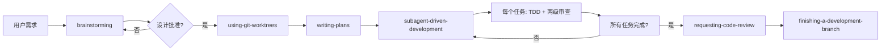

# Superpowers vs BMAD 详细对比分析

**日期**: 2026-02-23
**分析者**: Claude Code
**版本**: Superpowers (GitHub), BMAD v6.0.1

---

## 📋 目录

1. [核心定位对比](#核心定位对比)
2. [架构与设计哲学](#架构与设计哲学)
3. [工作流与流程](#工作流与流程)
4. [技能与代理系统](#技能与代理系统)
5. [适用场景](#适用场景)
6. [集成与生态](#集成与生态)
7. [学习曲线](#学习曲线)
8. [成本与资源](#成本与资源)
9. [优缺点总结](#优缺点总结)
10. [推荐决策树](#推荐决策树)

---

## 核心定位对比

### Superpowers

**定位**: AI 编码代理的完整软件开发生命周期框架

**核心价值主张**:
- "让你的 AI 代理拥有超能力"
- 强制遵循 TDD、YAGNI、DRY 等最佳实践
- 通过**可组合技能**系统实现自动化工作流
- 专注于**编码质量和开发流程**

**关键来源**: [obra/superpowers](https://github.com/obra/superpowers) - 56k+ stars

### BMAD (Breakthrough Method of Agile AI Driven Development)

**定位**: AI 驱动的敏捷开发框架,强调产品思维和协作

**核心价值主张**:
- "Scale-Adaptive Intelligence" - 根据项目复杂度自动调整规划深度
- 通过**专业角色代理**(PM、架构师、UX、开发等)实现多领域协作
- 专注于**产品发现、设计和团队协作**
- 文档驱动开发(先写文档,再写代码)

**关键来源**: [bmad-code/BMAD-METHOD](https://github.com/bmadcode/BMAD-METHOD)

---

## 架构与设计哲学

### Superpowers 架构

**核心设计理念**:

1. **技能系统 (Composable Skills)**
   ```
   brainstorming → using-git-worktrees → writing-plans →
   subagent-driven-development → test-driven-development →
   requesting-code-review → finishing-a-development-branch
   ```

2. **铁律 (Iron Laws)**:
   - TDD: "NO PRODUCTION CODE WITHOUT A FAILING TEST FIRST"
   - 调试: "NO FIXES WITHOUT ROOT CAUSE INVESTIGATION FIRST"
   - 违反字面规则 = 违反精神规则

3. **原子任务分解**:
   - 每个任务 2-5 分钟可完成
   - 精确到文件路径、代码行号、测试命令
   - 任务间完全独立,支持并行执行

4. **两级代码审查**:
   - 第一级: 规范合规审查 (代码是否完全符合规范)
   - 第二级: 代码质量审查 (实现是否优秀)

**技术实现**:
- 平台: Claude Code / Cursor / Codex / OpenCode
- 技能文件: Markdown 格式的 SKILL.md
- 触发机制: 关键词自动触发 (如 "help me plan")
- 插件市场: obra/superpowers-marketplace

### BMAD 架构

**核心设计理念**:

1. **Scale-Adaptive Intelligence (自适应规模)**
   ```
   小项目: 快速流 (/quick-flow)
   中项目: PM → UX → Dev
   大项目: 完整 12 代理工作流
   ```

2. **多智能体协作 (Party Mode)**:
   - 10+ 专业角色: PM、Architect、UX Designer、Dev、QA、Scrum Master、Analyst、Tech Writer
   - 同一会话中多角色讨论
   - 协作式发现,而非假设驱动

3. **14 步 UX 设计工作流**:
   ```
   Phase 1: 理解与发现 (Steps 1-2)
   Phase 2: 核心体验定义 (Steps 3-4)
   Phase 3: 设计系统与视觉基础 (Steps 5-8)
   Phase 4: 设计方向与组件 (Steps 9-11)
   Phase 5: UX 模式与完成 (Steps 12-14)
   ```

4. **A/P/C 协作菜单**:
   - **A**dvanced Elicitation: 深度探索需求
   - **P**arty Mode: 多智能体讨论
   - **C**ontinue: 进入下一步

**技术实现**:
- 平台: Claude Code (主要)
- 配置: YAML + Markdown
- 工作流: _bmad/bmm/workflows/
- 代理定义: _bmad/bmm/agents/
- 输出目录: _bmad-output/

---

## 工作流与流程

### Superpowers 标准工作流



**关键特点**:
- **强制性流程**: 每个步骤都必须完成,不能跳过
- **单向流动**: 设计 → 计划 → 实现 → 审查
- **自动化**: 技能自动触发,无需人工干预

### BMAD 标准工作流


**关键特点**:
- **灵活路径**: 根据项目规模调整流程
- **迭代循环**: 每个阶段都有回顾和调整机会
- **协作优先**: Party Mode 允许多角色讨论

---

## 技能与代理系统

### Superpowers 技能系统

**14 个核心技能**:

| 技能 | 触发条件 | 核心功能 |
|------|---------|----------|
| **brainstorming** | 任何创造性工作前 | 通过提问探索需求,提出 2-3 种方案 |
| **using-git-worktrees** | 设计批准后 | 创建隔离的工作空间,运行项目设置 |
| **writing-plans** | 有设计规范后 | 创建详细的实施计划(2-5分钟/任务) |
| **subagent-driven-development** | 有实施计划后 | 派遣独立子代理执行每个任务,两级审查 |
| **executing-plans** | 并行会话执行 | 批量执行任务,人工检查点 |
| **test-driven-development** | 实现功能时 | RED-GREEN-REFACTOR 循环 |
| **systematic-debugging** | 遇到 bug 时 | 4 阶段根因分析(调查→模式→假设→实施) |
| **requesting-code-review** | 任务完成后 | 对照计划进行代码审查 |
| **receiving-code-review** | 收到审查反馈 | 响应反馈意见 |
| **using-superpowers** | 了解框架 | 技能系统介绍 |
| **writing-skills** | 创建新技能时 | 遵循最佳实践创建技能 |
| **verification-before-completion** | 完成任务前 | 确保修复真正有效 |
| **finishing-a-development-branch** | 所有任务完成 | 验证测试,选择合并/PR/丢弃 |
| **dispatching-parallel-agents** | 并行任务 | 并发派遣多个代理 |

**技能触发机制**:
- **自动触发**: 关键词匹配 (如 "debug this" → systematic-debugging)
- **强制激活**: brainstorming 在任何创造性工作前自动激活
- **手动调用**: `/plugin call superpowers:skill-name`

### BMAD 代理系统

**10+ 专业角色代理**:

| 代理 | 触发命令 | 角色职责 |
|------|---------|----------|
| **PM (产品经理)** | `/pm` | 创建 PRD、定义产品愿景、用户故事 |
| **UX Designer** | `/ux-designer` 或 `/ux-expert` | 14步 UX 设计工作流、设计系统选择 |
| **Architect** | `/architect` | 创建技术架构、系统设计、API 设计 |
| **Developer** | `/dev` | 实现代码、重构、单元测试 |
| **QA** | `/qa` | 代码审查、测试策略、质量检查 |
| **Scrum Master** | `/sm` 或 `/quick-flow` | Sprint 规划、任务管理、快速流 |
| **Analyst** | `/analyst` | 市场调研、竞品分析、数据分析 |
| **Tech Writer** | `/tech-writer` | API 文档、用户手册、技术规范 |
| **Quick Flow** | `/quick` | 小型功能和 Bug 修复的简化流程 |
| **BMAD Master** | `/bmad-master` | 工作流协调、帮助和指导 |

**Party Mode (多智能体协作)**:
```bash
/party-mode

"Bring in the PM, Architect, and UX Designer to discuss the authentication flow"
```

**代理激活机制**:
- **命令触发**: 输入 `/role-name` 激活对应代理
- **上下文感知**: 代理会加载项目相关文档和上下文
- **状态保持**: 每个代理有独立的工作流状态

---

## 适用场景

### Superpowers 最佳场景

✅ **最适合**:
1. **重构现有代码库** - 特别是测试覆盖率低的项目
2. **Bug 修复** - systematic-debugging 技能确保找到根因
3. **功能实现** - 强制 TDD 确保代码质量
4. **代码审查** - 两级审查机制保证质量
5. **团队协作开发** - 原子任务分解易于并行

⚠️ **不太适合**:
- 产品需求不明确时 (BMAD 的 brainstorming 更适合)
- 需要 UX 设计的场景 (BMAD 有专门的 UX 工作流)
- 快速原型 (Superpowers 强制 TDD,原型阶段可能过重)

### BMAD 最佳场景

✅ **最适合**:
1. **从 0 到 1 的产品** - 完整的 PM → UX → Arch 流程
2. **需要 UX 设计的项目** - 14 步 UX 工作流
3. **团队协作** - Party Mode 多角色讨论
4. **复杂产品规划** - Scale-Adaptive Intelligence
5. **文档驱动项目** - 先写文档再写代码

⚠️ **不太适合**:
- 小型 Bug 修复 (Superpowers 的 systematic-debugging 更高效)
- 纯技术重构 (BMAD 产品流程过重)
- 快速原型 (但 BMAD 有 /quick-flow 可用)

---

## 集成与生态

### Superpowers 生态

**支持的 IDE 平台**:
1. **Claude Code** (主要) - 插件市场: `obra/superpowers-marketplace`
2. **Cursor** - `/plugin-add superpowers`
3. **Codex** - 手动安装 (需复制技能文件)
4. **OpenCode** - 手动安装

**安装方式**:
```bash
# Claude Code
/plugin marketplace add obra/superpowers-marketplace
/plugin install superpowers@superpowers-marketplace

# Cursor
/plugin-add superpowers
```

**扩展性**:
- **创建自定义技能**: 使用 `writing-skills` 技能
- **技能市场**: 可分享和发现社区技能
- **技能依赖**: 技能可引用其他技能

**社区与资源**:
- GitHub: 56k+ stars
- 博客: [fsck.com](https://blog.fsck.com/2025/10/09/superpowers/)
- 许可证: MIT License

### BMAD 生态

**支持的 IDE 平台**:
1. **Claude Code** (主要) - 完整支持
2. 其他平台: 未明确支持

**安装方式**:
```bash
# 安装 BMAD
npx bmad-method install

# 或指定版本
npx bmad-method@6.0.1 install
```

**扩展性**:
- **自定义代理**: 创建新的代理定义 YAML
- **自定义工作流**: 在 _bmad/bmm/workflows/ 添加工作流
- **配置系统**: _config/ 目录中的配置文件

**社区与资源**:
- GitHub: [bmad-code/BMAD-METHOD](https://github.com/bmadcode/BMAD-METHOD)
- 文档: [docs.bmad-method.org](https://docs.bmad-method.org)
- Discord: [discord.gg/gk8jAdXWmj](https://discord.gg/gk8jAdXWmj)
- YouTube: [@BMadCode](https://www.youtube.com/@BMadCode)

---

## 学习曲线

### Superpowers 学习曲线

**入门难度**: ⭐⭐⭐☆☆ (中等)

**学习阶段**:

1. **基础理解 (1-2 小时)**:
   - 理解技能系统概念
   - 了解 7 阶段工作流
   - 掌握基本命令

2. **实践应用 (1-2 周)**:
   - 在小项目中使用
   - 熟悉自动触发机制
   - 理解 TDD 铁律

3. **高级掌握 (1 个月+)**:
   - 创建自定义技能
   - 优化工作流程
   - 理解两级审查机制

**关键挑战**:
- **TDD 严格要求** - 违反铁律需要重新开始
- **原子任务思维** - 需要练习分解任务
- **审查流程** - 两级审查可能增加初期时间

### BMAD 学习曲线

**入门难度**: ⭐⭐⭐⭐☆ (中高)

**学习阶段**:

1. **基础理解 (2-4 小时)**:
   - 理解多智能体协作概念
   - 了解 10+ 专业角色
   - 掌握基本命令

2. **实践应用 (2-4 周)**:
   - 完整产品开发流程
   - 熟悉 Party Mode
   - 理解 Scale-Adaptive Intelligence

3. **高级掌握 (2 个月+)**:
   - 自定义代理和工作流
   - 优化多智能体协作
   - 理解 14 步 UX 工作流

**关键挑战**:
- **概念复杂** - 需要理解产品管理、UX、架构等多个领域
- **流程较长** - 完整工作流涉及多个阶段和代理
- **文档量大** - 需要阅读和理解大量文档

---

## 成本与资源

### Superpowers 成本

**时间成本**:
- **初期投入**: 比传统开发多 20-30% (TDD、审查)
- **长期收益**: 减少 50-70% 的调试时间
- **ROI**: 1-2 个月后开始显现

**计算资源**:
- **子代理调用**: 每个 task 需要 3 个子代理 (实现 + 规范审查 + 质量审查)
- **成本控制**: 原子任务分解减少每个任务的 token 消耗

**维护成本**:
- **技能更新**: `/plugin update superpowers`
- **自定义技能**: 使用 writing-skills 技能创建

### BMAD 成本

**时间成本**:
- **初期投入**: 比传统开发多 40-60% (PM、UX、架构规划)
- **长期收益**: 减少 70-80% 的返工和需求变更
- **ROI**: 2-3 个月后开始显现

**计算资源**:
- **Party Mode**: 多代理同时运行 (成本较高但产出质量高)
- **文档生成**: 大量文档生成 token 消耗

**维护成本**:
- **版本更新**: `npx bmad-method@latest install`
- **自定义代理**: 创建 YAML 配置文件

---

## 优缺点总结

### Superpowers

**优点** ✅:
1. **代码质量优先**: 强制 TDD 和代码审查
2. **原子任务**: 2-5 分钟/任务,易于并行
3. **自动化**: 技能自动触发,无需人工干预
4. **跨平台**: 支持 Claude Code、Cursor、Codex、OpenCode
5. **成熟社区**: 56k+ stars,文档完善
6. **高效调试**: systematic-debugging 确保找到根因
7. **两级审查**: 规范 + 质量双重保障

**缺点** ❌:
1. **缺少产品思维**: 不关注产品需求和市场
2. **无 UX 设计**: 没有专门的 UX 工作流
3. **TDD 过重**: 对于原型阶段可能不适用
4. **单一流程**: 所有项目都走同样流程 (不够灵活)
5. **缺少文档驱动**: 不强调先写文档再写代码

### BMAD

**优点** ✅:
1. **产品思维完整**: PM → UX → Arch 完整流程
2. **Scale-Adaptive**: 根据项目规模自动调整
3. **多智能体协作**: Party Mode 允许多角色讨论
4. **14 步 UX**: 最全面的 UX 设计工作流
5. **文档驱动**: 先写文档再写代码
6. **快速流**: /quick-flow 适合小型任务
7. **中文友好**: 文档和社区对中文支持好

**缺点** ❌:
1. **学习曲线陡**: 概念多、流程长
2. **流程过重**: 对小项目可能过度设计
3. **平台限制**: 主要支持 Claude Code
4. **社区较小**: 相比 Superpowers 社区规模较小
5. **调试流程弱**: 没有 systematic-debugging 这样的专门技能
6. **TDD 不够强调**: 虽然有测试,但不如 Superpowers 严格

---

## 推荐决策树

### 场景 1: 从 0 到 1 开发新产品

**推荐**: BMAD

**理由**:
- 需要完整的产品思维 (PM、UX、Arch)
- BMAD 的 14 步 UX 工作流确保用户体验
- Scale-Adaptive Intelligence 适合从简单到复杂的产品

**使用方式**:
```
1. /pm - 创建 PRD
2. /ux-designer - 14 步 UX 设计
3. /architect - 技术架构
4. /sm - Sprint 规划
5. /dev - 实施
6. /qa - 质量保证
```

### 场景 2: 重构现有代码库

**推荐**: Superpowers

**理由**:
- systematic-debugging 找到根因
- test-driven-development 确保重构安全
- 两级审查保证代码质量

**使用方式**:
```
1. brainstorming - 理解重构需求
2. writing-plans - 创建详细计划
3. subagent-driven-development - 执行重构
4. requesting-code-review - 审查重构结果
```

### 场景 3: Bug 修复

**推荐**: Superpowers

**理由**:
- systematic-debugging 4 阶段根因分析
- test-driven-development 创建失败测试
- verification-before-completion 确保修复有效

**使用方式**:
```
1. systematic-debugging - 找到根因
2. test-driven-development - 创建失败测试并修复
3. verification-before-completion - 验证修复
```

### 场景 4: 快速原型

**推荐**: BMAD (/quick-flow) 或 Superpowers (跳过 brainstorming)

**理由**:
- BMAD 的 /quick-flow 专为小型任务设计
- Superpowers 可以跳过 brainstorming 直接实施

**使用方式** (BMAD):
```
/quick-flow

# 或
/quick
```

**使用方式** (Superpowers):
```
writing-plans (跳过 brainstorming)
subagent-driven-development
```

### 场景 5: 大型团队协作项目

**推荐**: BMAD + Superpowers 组合

**理由**:
- BMAD 提供产品、UX、架构层面的协作
- Superpowers 确保代码质量和 TDD
- Party Mode 让多角色讨论
- 两级审查保证代码质量

**使用方式**:
```
# 产品和设计阶段 (BMAD)
1. /pm - 创建 PRD
2. /ux-designer - UX 设计
3. Party Mode - 多角色讨论

# 实施阶段 (Superpowers)
4. brainstorming - 技术方案讨论
5. writing-plans - 详细实施计划
6. subagent-driven-development - 执行实施

# 质量保证 (两者结合)
7. requesting-code-review - Superpowers 审查
8. /qa - BMAD QA 审查
```

---

## 针对当前项目 (Composition Evaluator) 的建议

### 当前状态

✅ 已完成:
- 基于 FastAPI Users 的身份验证系统
- 前端 Next.js 登录页面
- 后端认证 API (短信、密码、微信)

🔄 进行中:
- 登录页面重构 (role-auth-page.tsx: 685 行)
- 安全改进
- 可访问性增强

### 推荐方案

**阶段 1: 当前重构工作 - 使用 Superpowers**

理由:
- 已经有明确的需求 (重构登录页面)
- 需要保证代码质量
- systematic-debugging 可用于发现现有代码问题
- TDD 确保重构不引入新 bug

**工作流**:
```
1. brainstorming - 讨论重构方案
2. writing-plans - 创建详细实施计划
3. subagent-driven-development - 执行重构
4. requesting-code-review - 审查重构结果
5. test-driven-development - 确保 TDD
```

**阶段 2: 新功能开发 - 使用 BMAD**

理由:
- 需要完整的产品思维
- UX 设计很重要 (教师/学生双角色)
- 需要架构设计

**工作流**:
```
1. /pm - 创建 PRD (如教师任务中心)
2. /ux-designer - UX 设计 (14 步工作流)
3. /architect - 技术架构
4. /sm - Sprint 规划
5. /dev - 实施 (可结合 Superpowers TDD)
6. /qa - 质量保证
```

**阶段 3: 持续维护 - Superpowers 为主 + BMAD 辅助**

- Bug 修复: Superpowers systematic-debugging
- 小功能: BMAD /quick-flow
- 大功能: BMAD 完整流程
- 重构: Superpowers

---

## 总结

### 核心差异

| 维度 | Superpowers | BMAD |
|------|-------------|------|
| **关注点** | 代码质量和开发流程 | 产品发现和团队协作 |
| **核心理念** | TDD、原子任务、两级审查 | Scale-Adaptive、多智能体、文档驱动 |
| **适用阶段** | 实施和重构 | 产品规划和设计 |
| **流程刚性** | 高 (铁律不可违反) | 中 (Scale-Adaptive) |
| **学习曲线** | 中等 | 中高 |
| **社区规模** | 大 (56k+ stars) | 小 |
| **中文支持** | 低 | 高 |

### 最佳实践

**两者不是竞争关系,而是互补关系**:

1. **BMAD 用于"做什么"和"为什么"** - 产品、UX、架构
2. **Superpowers 用于"怎么做"** - 编码、测试、审查

**理想工作流**:
```
想法 → BMAD PM → BMAD UX → BMAD Arch →
Superpowers brainstorming → Superpowers planning →
Superpowers implementation → Superpowers review →
BMAD QA
```

### 最终建议

对于 **Composition Evaluator 项目**:

1. **当前重构工作**: 使用 **Superpowers**
   - systematic-debugging 分析现有代码
   - test-driven-development 确保重构安全
   - 两级审查保证质量

2. **未来新功能**: 使用 **BMAD + Superpowers**
   - BMAD 处理产品和设计
   - Superpowers 处理实施和代码质量

3. **团队协作**: 使用 **BMAD Party Mode**
   - 多角色讨论重要决策
   - Scale-Adaptive 调整流程深度

4. **持续改进**:
   - Bug 修复: Superpowers
   - 小功能: BMAD /quick-flow
   - 大功能: BMAD 完整流程

---

**创建时间**: 2026-02-23
**作者**: Claude Code
**参考资源**:
- [Superpowers GitHub](https://github.com/obra/superpowers)
- [BMAD GitHub](https://github.com/bmadcode/BMAD-METHOD)
- [Superpowers Blog](https://blog.fsck.com/2025/10/09/superpowers/)
- [BMAD 文档](https://docs.bmad-method.org)
